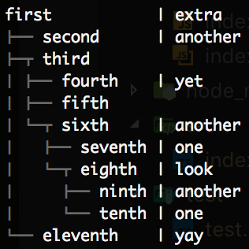

# Format Tree
This library allows complete formatting of trees with guides and configurability. The functions expect the predefined structure as defined in [index.ts](src/index.ts), and the full documentation for that format is also described there. However, some examples are show here (which are taken from the [test file](test/test.ts))

## Node-based
Source:

```ts
formatTreeString(
  {
    text: 'first',
    extra: 'extra',
    children: [
      {
        text: 'second',
        extra: 'another'
      },
      {
        text: 'third',
        children: [
          {
            text: 'fourth',
            extra: 'yet'
          },
          {
            text: 'fifth'
          },
          {
            text: 'sixth',
            extra: 'another',
            children: [
              {
                text: 'seventh',
                extra: 'one'
              },
              {
                text: 'eighth',
                extra: 'look',
                children: [
                  {
                    text: 'ninth',
                    extra: 'another'
                  },
                  {
                    text: 'tenth',
                    extra: 'one'
                  }
                ]
              }
            ]
          }
        ]
      },
      {
        text: 'eleventh',
        extra: 'yay'
      }
    ]
  },
  {
    guideFormat: chalk.dim
  }
);
```

Output:


## List-style
Source:

```ts
formatTreeString(
  [
    {
      text: 'first',
      extra: 'extra'
    },
    {
      text: 'second',
      extra: 'another'
    },
    {
      text: 'third',
      children: [
        {
          text: 'fourth',
          extra: 'yet'
        },
        {
          text: 'fifth'
        },
        {
          text: 'sixth',
          extra: 'another',
          children: [
            {
              text: 'seventh',
              extra: 'one'
            },
            {
              text: 'eighth',
              extra: 'look',
              children: [
                {
                  text: 'ninth',
                  extra: 'another'
                },
                {
                  text: 'tenth',
                  extra: 'one'
                }
              ]
            }
          ]
        }
      ]
    },
    {
      text: 'eleventh',
      extra: 'yay'
    }
  ],
  {
    guideFormat: chalk.dim
  }
)
```

Output:

