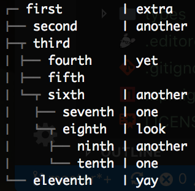

# Format Tree
This library allows complete formatting of trees with guides and configurability that look similar to how npm and yarn dispay trees. The functions expect the predefined structure as defined in [mod.ts](lib/mod.ts), and the full documentation for that format is also described there. However, some examples are shown here (which are taken from the [test file](test/test.ts))

This library is compatible with [deno](https://github.com/denoland/deno) via the following direct import:

`https://raw.githubusercontent.com/luvies/format-tree/{tag}/lib/mod.ts`

or by using the slightly nicer:

`https://denopkg.com/luvies/format-tree@{tag}/lib/mod.ts`

In both cases, the `{tag}` identifier is the release version you are targeting. I would recommend against using master directly (as, in general, the master branch is not guaranteed to be stable).

## With first item
Source:

```ts
formatTreeString(
  {
    text: 'first',
    extra: 'extra',
    children: [
      {
        text: 'second',
        extra: 'another'
      },
      {
        text: 'third',
        children: [
          {
            text: 'fourth',
            extra: 'yet'
          },
          {
            text: 'fifth'
          },
          {
            text: 'sixth',
            extra: 'another',
            children: [
              {
                text: 'seventh',
                extra: 'one'
              },
              {
                text: 'eighth',
                extra: 'look',
                children: [
                  {
                    text: 'ninth',
                    extra: 'another'
                  },
                  {
                    text: 'tenth',
                    extra: 'one'
                  }
                ]
              }
            ]
          }
        ]
      },
      {
        text: 'eleventh',
        extra: 'yay'
      }
    ]
  },
  {
    guideFormat: chalk.dim
  }
);
```

Output:


## Without first item
Source:

```ts
formatTreeString(
  [
    {
      text: 'first',
      extra: 'extra'
    },
    {
      text: 'second',
      extra: 'another'
    },
    {
      text: 'third',
      children: [
        {
          text: 'fourth',
          extra: 'yet'
        },
        {
          text: 'fifth'
        },
        {
          text: 'sixth',
          extra: 'another',
          children: [
            {
              text: 'seventh',
              extra: 'one'
            },
            {
              text: 'eighth',
              extra: 'look',
              children: [
                {
                  text: 'ninth',
                  extra: 'another'
                },
                {
                  text: 'tenth',
                  extra: 'one'
                }
              ]
            }
          ]
        }
      ]
    },
    {
      text: 'eleventh',
      extra: 'yay'
    }
  ],
  {
    guideFormat: chalk.dim
  }
)
```

Output:


